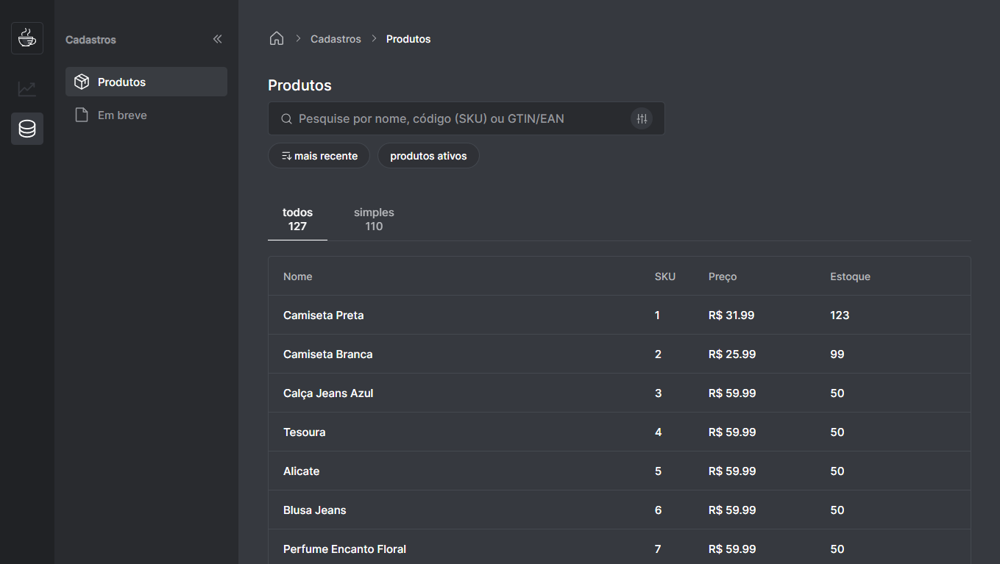
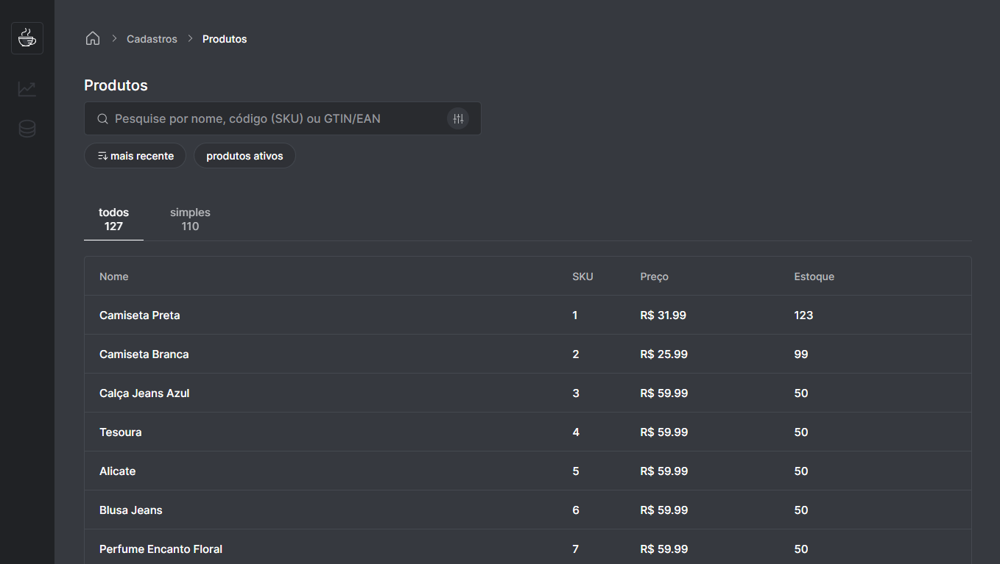

## Sellez

Um app ERP para gestão empresarial com foco em e-commerce e marketplaces.

[](https://github.com/lucaslousada)
[](#)
[](#)
[](#)
[](LICENSE.md)

🚧 App em desenvolvimento... 🚧

<div style="display: flex; flex-wrap: wrap; gap: 1%;">
  
  
</div>

## Tecnologias

Esse projeto foi desenvolvido com as seguintes tecnologias:

- ReactJS
- TypeScript
- Vite
- React Router Dom
- Axios
- Json Server
- Styled Components
- Radix UI
- Phosphor Icons
- e outros.

<!-- ## Features

- [x] Listagem de produtos cadastrados.
- [ ] Cadastrar, editar e deletar produtos.
- [ ] Ver detalhes de um produto.
- [ ] Listagem de pedidos realizados.
- [ ] Abrir, finalizar e cancelar um pedido.
- [ ] Ver detalhes de um pedido.
- [x] Ocultar/exibir navegação lateral.
- [ ] Página 404. -->

## Executar o projeto

Você precisa instalar o [Git](https://git-scm.com/downloads) e o [Node.js](https://nodejs.org/en/download/) para executar este projeto.
Você pode usar [Yarn](https://yarnpkg.com/) ou [Npm](https://nodejs.org/en/download/).

```bash
# Clone o projeto e acesse a pasta
$ git clone https://github.com/lucaslousada/sellez.git && cd sellez
# Instale as dependências
$ yarn
# Inicie a fake api com
$ yarn server
# Inicie o servidor com
$ yarn dev
```

## Licença

Este projeto está licenciado sob a Licença MIT - veja o arquivo [LICENSE](LICENSE.md) para mais detalhes.
